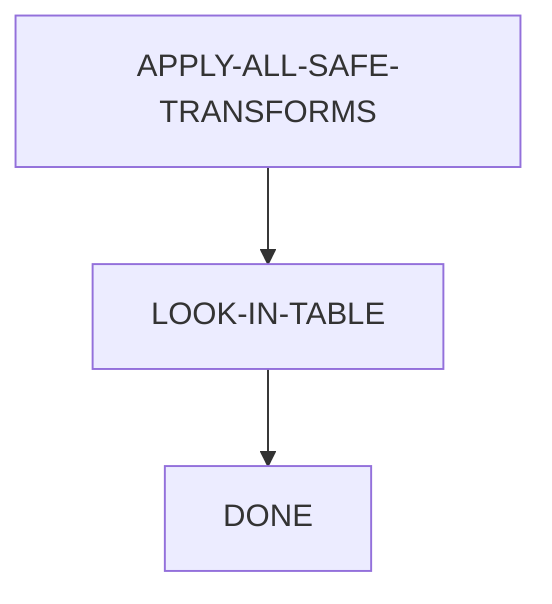

# Generate and Test

# Problem Reduction

## Safe Transform

$$
\int-f(x)=-\int f(x)\\
\int cf(x)dx=c\int f(x)dx\\
\int\sum f(x)dx=\sum\int f(x)dx
$$

It is the core of an integration program

What we need to solve is:
$$
\int\frac{-5x^4}{(1-x^2)^{5/2}}dx
$$
